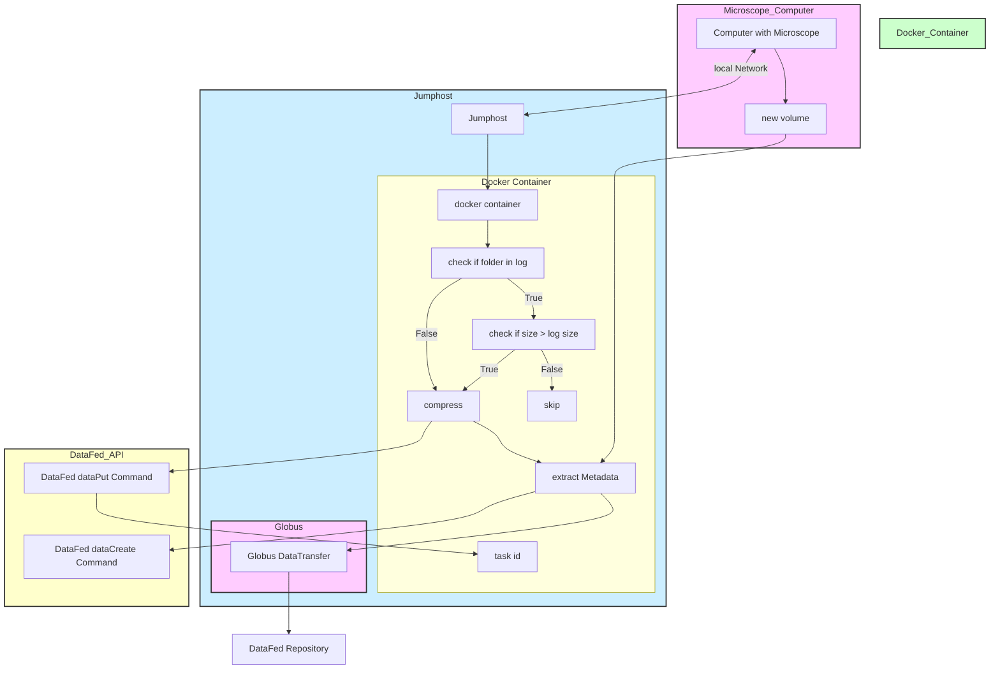

```mermaid
flowchart TD
    subgraph Microscope_Computer
        style Microscope_Computer fill:#ffccff,stroke:#333,stroke-width:2px
        microscope_computer[Computer with Microscope] --> B[new volume]
    end

    subgraph Jumphost
        style Jumphost fill:#cceeff,stroke:#333,stroke-width:2px
        microscope_computer <-->|local Network| jumphost[Jumphost]
        jumphost --> docker_container[docker container]

        subgraph Docker Container
            style Docker_Container fill:#ccffcc,stroke:#333,stroke-width:2px
            docker_container --> E[check if folder in log]
            E -->|True| F[check if size > log size]
            E -->|False| G[compress]
            F -->|False| I[skip]
            F -->|True| G
            G --> H[extract Metadata]
            B --> H
            task[task id]
        end

        subgraph Globus
            style Globus fill:#ffccff,stroke:#333,stroke-width:2px
            H --> globus[Globus DataTransfer]
        end
    end

    globus --> repo[DataFed Repository]

    subgraph DataFed_API
        direction LR
        style DataFed_API fill:#ffffcc,stroke:#333,stroke-width:2px
        H --> datafed1[DataFed dataCreate Command]
        G --> datafed2[DataFed dataPut Command]
    end

    %% Explicit cross-subgraph arrow from dataPut Command to task id in Docker Container
    datafed2 --> task
```
