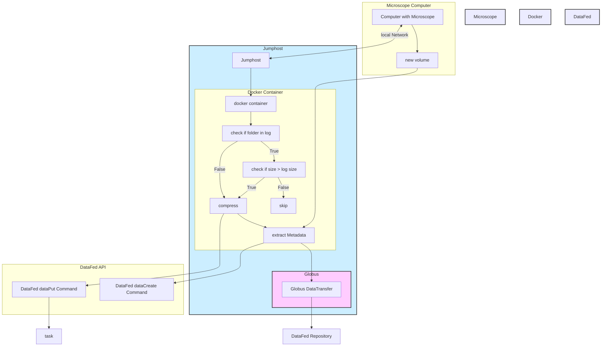

```mermaid
flowchart TD
    subgraph Microscope Computer
        style Microscope Computer fill:#ffccff,stroke:#333,stroke-width:2px
        microscope_computer[Computer with Microscope] --> B[new volume]
    end

    subgraph Jumphost
        style Jumphost fill:#cceeff,stroke:#333,stroke-width:2px
        microscope_computer <-->|local Network| jumphost[Jumphost]
        jumphost --> docker_container[docker container]

        subgraph Docker Container
            style Docker Container fill:#ccffcc,stroke:#333,stroke-width:2px
            docker_container --> E[check if folder in log]
            E -->|True| F[check if size > log size]
            E -->|False| G[compress]
            F -->|False| I[skip]
            F -->|True| G
            G --> H[extract Metadata]
            B --> H

        end

        subgraph Globus
            style Globus fill:#ffccff,stroke:#333,stroke-width:2px
            H --> globus[Globus DataTransfer]
        end
    end

    globus --> repo[DataFed Repository]

    subgraph DataFed API
        style DataFed API fill:#ffffcc,stroke:#333,stroke-width:2px
        H --> datafed1[DataFed dataCreate Command]
        G --> datafed2[DataFed dataPut Command]
    end

    %% Explicit arrow from DataFed dataPut to task id
    datafed2 --> task

```
